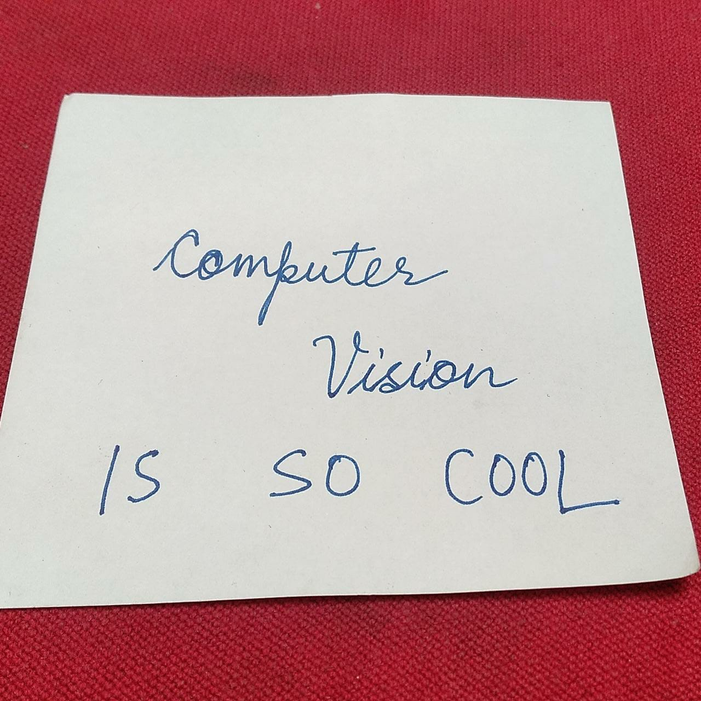
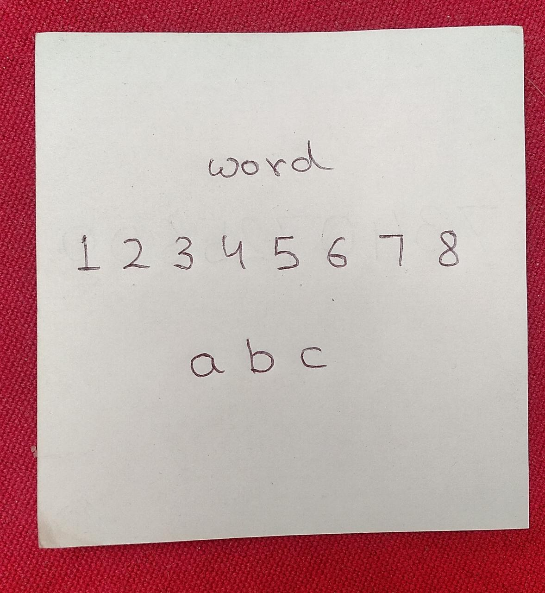
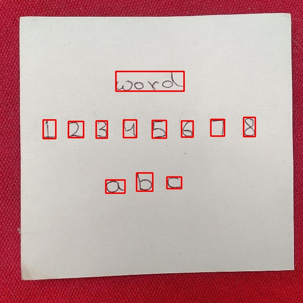

# TextSegmentation
Using Otsu's thresholding for text segmentation on images of sticky notes.
Assumptions
 * The image has a dark background below the paper
 * The writing is darker than the paper.
 * The image is 1:1 aspect ratio
 
Proof of concept python notebook can be found in html format [here](https://ekan5h.github.io/TextSegmentation/)

## Examples:
Example 1

 

Example 2

 
</div
